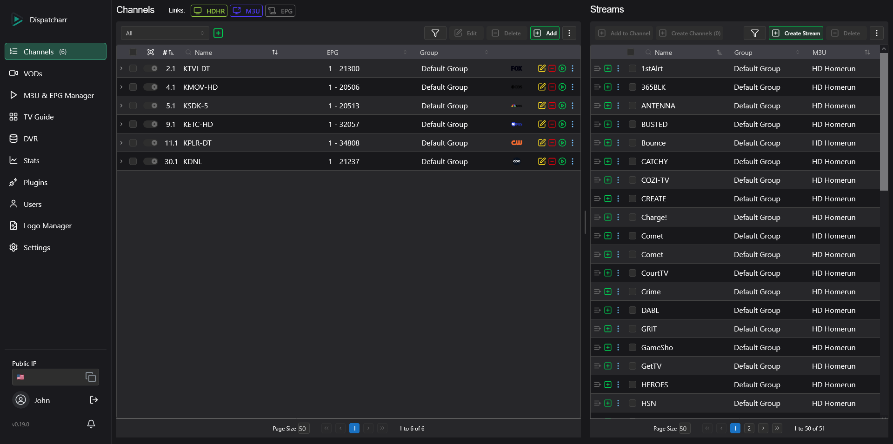
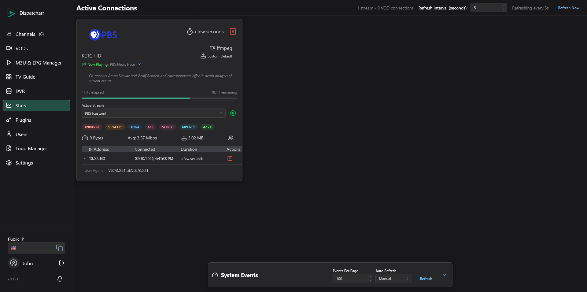

# 🎬 ArgusFlix — Your Ultimate IPTV & Stream Management Companion

<p align="center">
  
</p>

---

## 📖 What is ArgusFlix?

ArgusFlix (pronounced like "dispatcher") is an **open-source powerhouse** for managing IPTV streams, EPG data, and VOD content with elegance and control.\
Born from necessity and built with passion, it started as a personal project by **[OkinawaBoss](https://github.com/OkinawaBoss)** and evolved with contributions from legends like **[dekzter](https://github.com/dekzter)**, **[SergeantPanda](https://github.com/SergeantPanda)** and **Bucatini**.

> Think of ArgusFlix as the \*arr family's IPTV cousin — simple, smart, and designed for streamers who want reliability and flexibility.

---

## 🎯 What Can I Do With ArgusFlix?

ArgusFlix empowers you with complete IPTV control. Here are some real-world scenarios:

💡 **Consolidate Multiple IPTV Sources**\
Combine streams from multiple providers into a single interface. Manage, filter, and organize thousands of channels with ease.

📺 **Integrate with Media Centers**\
Use HDHomeRun emulation to add virtual tuners to **Plex**, **Emby**, or **Jellyfin**. They'll discover ArgusFlix as a live TV source and can record programs directly to their own DVR libraries.

📡 **Create a Personal TV Ecosystem**\
Merge live TV channels with custom EPG guides. Generate XMLTV schedules or use auto-matching to align channels with existing program data. Export as M3U, Xtream Codes API, or HDHomeRun device.

🔧 **Transcode & Optimize Streams**\
Configure output profiles with FFmpeg transcoding to optimize streams for different clients (reduce bandwidth, standardize formats, or add audio normalization).

🔐 **Centralize VPN Access**\
Run ArgusFlix through a VPN container (like Gluetun) so all streams route through a single VPN connection. Your clients access geo-blocked content without needing individual VPNs, reducing bandwidth overhead and simplifying network management.

🚀 **Monitor & Manage in Real-Time**\
Track active streams, client connections, and bandwidth usage with live statistics. Monitor buffering events and stream quality. Automatic failover keeps viewers connected when streams fail—seamlessly switching to backup sources without interruption.

👥 **Share Access Safely**\
Create multiple user accounts with granular permissions. Share streams via M3U playlists or Xtream Codes API while controlling which users access which channels, profiles, or features. Network-based access restrictions available for additional security.

🔌 **Extend with Plugins**\
Build custom integrations using ArgusFlix's robust plugin system. Automate tasks, connect to external services, or add entirely new workflows.

---

## ✨ Why You'll Love ArgusFlix

✅ **Stream Proxy & Relay** — Intercept and proxy IPTV streams with real-time client management\
✅ **M3U & Xtream Codes** — Import, filter, and organize playlists with multiple backend support\
✅ **EPG Matching & Generation** — Auto-match EPG to channels or generate custom TV guides\
✅ **Video on Demand** — Stream movies and TV series with rich metadata and IMDB/TMDB integration\
✅ **Multi-Format Output** — Export as M3U, XMLTV EPG, Xtream Codes API, or HDHomeRun device\
✅ **Real-Time Monitoring** — Live connection stats, bandwidth tracking, and automatic failover\
✅ **Stream Profiles** — Configure how ArgusFlix connects to backend streams (VLC, FFmpeg, Streamlink, or custom commands)\
✅ **Output Profiles** — Transcode what stream profiles deliver before it reaches the client (e.g. AC3 for media servers, AAC for browsers) with fMP4 or MPEG-TS container selection\
✅ **Multi-User & Access Control** — Granular permissions and network-based access restrictions\
✅ **Plugin System** — Extend functionality with custom plugins for automation and integrations\
✅ **Fully Self-Hosted** — Total control, no third-party dependencies

---

# Screenshots

<div align="center">
  
  
  
  
  
  
</div>

---

## 🛠️ Troubleshooting & Help

- **General help?** Visit [ArgusFlix Docs](https://argusflix_manager.github.io/ArgusFlix-Docs/)
- **Community support?** Join our [Discord](https://discord.gg/Sp45V5BcxU)

---

## 🚀 Get Started in Minutes

### 🐧 Ubuntu / Debian Auto-Installer (New!)

For a completely automated, "One-Click" setup on a fresh Ubuntu or Debian server:

```bash
wget -qO- https://raw.githubusercontent.com/hellboy1974/argusflix-manager/main/install_ubuntu.sh | sudo bash
```
> This intelligent script automatically installs Docker, clones the repository, generates secure passwords (`.env`), sets up the database, and pre-seeds the system with 48 country-specific EPG fixtures!

---

### 🔄 Ubuntu / Debian Auto-Updater

To securely update a running ArgusFlix Manager installation with upstream changes without losing your custom apps or settings:

```bash
wget -qO- https://raw.githubusercontent.com/hellboy1974/argusflix-manager/main/update_ubuntu.sh | sudo bash
```
> This script safely merges upstream changes using Git, builds/updates the Docker containers (or applies native virtualenv migrations) and restarts the services.

---

### 📦 Unraid Community Application (New!)

You can now easily install ArgusFlix Manager natively in Unraid:
1. Copy the `docker-templates/argusflix.xml` file into your Unraid flash drive at `config/plugins/dockerMan/templates-user/`.
2. Open the Unraid GUI -> **Docker** tab -> **Add Container**.
3. Select **ArgusFlix-Manager** from the User Templates dropdown.

---

### 🐳 Quick Start with Docker (Recommended)

```bash
docker pull ghcr.io/argusflix_manager/argusflix_manager:latest
docker run -d \
  -p 8000:8000 \
  --name argusflix_manager \
  -v argusflix_manager_data:/app/data \
  ghcr.io/argusflix_manager/argusflix_manager:latest
```

> Customize ports and volumes to fit your setup.

---

### 🐋 Docker Compose Options

| Use Case                    | File                                                    | Description                                                                                                   |
| --------------------------- | ------------------------------------------------------- | ------------------------------------------------------------------------------------------------------------- |
| **All-in-One Deployment**   | [docker-compose.aio.yml](docker/docker-compose.aio.yml) | ⭐ Recommended! A simple, all-in-one solution — everything runs in a single container for quick setup.        |
| **Modular Deployment**      | [docker-compose.yml](docker/docker-compose.yml)         | Separate containers for ArgusFlix, Celery, Redis, and Postgres — perfect if you want more granular control. |
| **Development Environment** | [docker-compose.dev.yml](docker/docker-compose.dev.yml) | Developer-friendly setup with pre-configured ports and settings for contributing and testing.                 |

---

### 🛠️ Building from Source

> ⚠️ **Warning**: Not officially supported — but if you're here, you know what you're doing!

If you are running a Debian-based OS, use the `debian_install.sh` script. For other OS, contribute a script and we’ll add it!

---

## 🤝 Want to Contribute?

We welcome **PRs, issues, ideas, and suggestions**!

- Prior to contributing, please read the [CONTRIBUTING.md](https://github.com/ArgusFlix/ArgusFlix/blob/main/CONTRIBUTING.md)

> Whether it's writing docs, squashing bugs, or building new features, your contribution matters! 🙋

---

## 📚 Documentation & Roadmap

- 📖 **Documentation:** [ArgusFlix Docs](https://argusflix_manager.github.io/ArgusFlix-Docs/)

**Upcoming Features (in no particular order):**

- 🎬 **VOD Management Enhancements** — Granular metadata control and cleanup of unwanted VOD content
- 📁 **Media Library** — Import local files and serve them over XC API
- 👥 **Enhanced User Management** — Customizable XC API output per user account
- 🔌 **Fallback Videos** — Automatic fallback content when channels are unavailable

---

## ❤️ Shoutouts

A huge thank you to all the incredible open-source projects and libraries that power ArgusFlix. We stand on the shoulders of giants!

---

## ✉️ Connect With Us

Have a question? Want to suggest a feature? Just want to say hi?\
➡️ **[Open an issue](https://github.com/ArgusFlix/ArgusFlix/issues)** or reach out on [Discord](https://discord.gg/Sp45V5BcxU).

---

## 💖 Support ArgusFlix

[](https://opencollective.com/argusflix_manager/contribute)

Open Collective provides a transparent way for anyone who finds value in ArgusFlix to support things like:
• Infrastructure costs (Domains, Servers, etc.)
• Apple Developer Program and Google Play Developer accounts
• Helping contributors dedicate more time to improving the project

Support is completely optional, and ArgusFlix will always remain free and open-source.

[Contribute here](https://opencollective.com/argusflix_manager/contribute)

---

## ⚖️ License & Legal

ArgusFlix is licensed under **GNU AGPL v3.0**: For full license details, see [LICENSE](https://www.gnu.org/licenses/agpl-3.0.html).

ArgusFlix is a trademark of the ArgusFlix project. Use of the ArgusFlix name or logo requires permission from the maintainers.

---

### 🚀 _Happy Streaming! The ArgusFlix Team_
